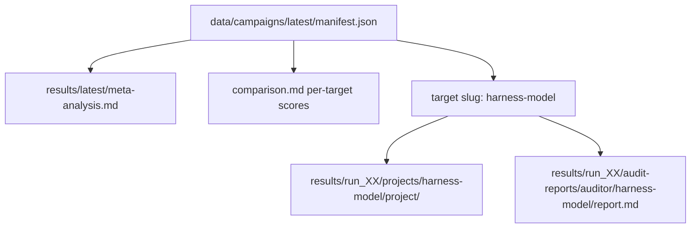
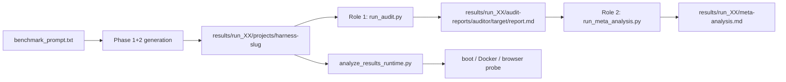

# LLM Python Coding Benchmark

Autonomous coding agents receive the same fixed brief — a Django + Channels chat SPA
that streams from a local Ollama model — and run through four harness backends
(opencode, codex, claude, cursor). This project measures **how well each harness and
model delivers spec-compliant code**, using a structured LLM audit rubric and a
cross-run meta-analysis.

## Latest results

| Field | Link |
|-------|------|
| Campaign | [`2026-05-ollama-cloud-v3.2`](data/campaigns/2026-05-ollama-cloud-v3.2/manifest.json) |
| Meta-analysis | [`results/latest/meta-analysis.md`](results/latest/meta-analysis.md) |
| Score index | [`results/run_01/audit-reports/codex_gpt_5_5/comparison.md`](results/run_01/audit-reports/codex_gpt_5_5/comparison.md) |
| Generated code | [`results/run_01/projects/`](results/run_01/projects/) (28 targets listed in manifest) |
| Auditor | `codex_gpt_5_5` |

Headline from the latest meta-analysis: **best open-source model**
`deepseek_v4_pro_ollama_cloud` (74.0/100 cross-harness mean); **best contest harness**
`codex` (61.1/100 avg on the shared Ollama grid). See the full report for harness
pairings, dimension breakdown, cost, and calibration checks.

Symlinks [`data/campaigns/latest`](data/campaigns/latest) and
[`results/latest`](results/latest) are retargeted by
[`scripts/publish_campaign.py`](scripts/publish_campaign.py) on each publish — README
links stay stable across campaigns.

## Artifact map

Every published campaign is documented in a manifest under `data/campaigns/<id>/`.
The manifest lists target slugs and points at the audit tree; generated code lives
under `results/<run_id>/projects/` with the **same target slug**.

**Join key:** target slug `<harness>-<model>` (e.g. `codex-deepseek_v4_pro_ollama_cloud`)
is identical under `projects/` and `audit-reports/<auditor>/`.

**Per-target index:** [`comparison.md`](results/run_01/audit-reports/codex_gpt_5_5/comparison.md) lists
all targets with dimension scores — use it to find a run, then open `report.md` (rubric)
or `results/run_01/projects/<target>/project/` (source).

**Example:** `codex-deepseek_v4_pro_ollama_cloud` →
[`report.md`](results/run_01/audit-reports/codex_gpt_5_5/codex-deepseek_v4_pro_ollama_cloud/report.md) ·
[`project/`](results/run_01/projects/codex-deepseek_v4_pro_ollama_cloud/project/)

**Campaign history:** [`data/README.md`](data/README.md)

## How we assess models and harnesses

This harness compares autonomous coding agents on a **fixed implementation brief**.
Every `(harness, model)` pair receives the same prompts and is scored with the same
rubric. Cross-harness verdicts come from a second LLM pass that reads all audit
reports — it does not re-grade the generated code.

### Pipeline overview

| Phase | Script | Input | Output |
|-------|--------|-------|--------|
| Generation | `run_benchmark.py` | [`prompts/benchmark_prompt.txt`](prompts/benchmark_prompt.txt) + optional follow-up | `results/<run_id>/projects/<harness>-<slug>/project/` |
| Role 1 audit | `run_audit.py` | Generated `project/` + [`prompts/audit_prompt_template.txt`](prompts/audit_prompt_template.txt) | `results/<run_id>/audit-reports/<auditor>/<target>/report.md` |
| Role 2 meta-analysis | `run_meta_analysis.py` | All Role 1 reports + [`prompts/audit_meta_analysis_prompt.txt`](prompts/audit_meta_analysis_prompt.txt) | `results/<run_id>/meta-analysis.md` |
| Runtime verification (optional) | `analyze_results_runtime.py` | Generated `project/` | Boot/Docker/browser pass-fail under `_runtime_verification/` |

### Fixed task (generation)

**Prompt version:** `benchmark-v3.2` ([`prompts/benchmark_prompt.txt`](prompts/benchmark_prompt.txt))

Each agent must build, in the current working directory:

- Django + Django Channels ASGI app with an `AsyncWebsocketConsumer`
- HTMX WebSocket extension for streaming UI (no raw `new WebSocket(...)` path)
- `langchain-ollama` `ChatOllama` as the only LLM client (no direct `ollama` package)
- Tailwind via the official CLI (source CSS + built static CSS)
- `OLLAMA_HOST` / `OLLAMA_MODEL` from environment (defaults documented in `.env.example`)
- pytest, ruff, mypy, bandit, coverage.py, pip-audit
- Dockerfile + Docker Compose with Daphne or Uvicorn
- Real README with setup, Tailwind build, tests, and Docker commands

**Phase 2** ([`prompts/benchmark_followup_prompt.txt`](prompts/benchmark_followup_prompt.txt),
`benchmark-followup-v3.2`) asks the agent to boot the app, run tests and static checks,
validate Docker, and record results in README or `VERIFY.md`.

Four harness backends run the same brief: **opencode**, **codex**, **claude**, **cursor**
(see [`docs/configuration.md`](docs/configuration.md)).

### Role 1 audit (rubric scoring)

**Prompt version:** `audit-v3.8` ([`prompts/audit_prompt_template.txt`](prompts/audit_prompt_template.txt))

An LLM **auditor** reads one generated `project/` and writes a structured report with
sections A–I. The auditor verifies API claims against the project's own installed
packages (venv glob) before calling anything "hallucinated."

#### Dimension weights (100 points total)

| # | Dimension | Max |
|---|-----------|----:|
| D1 | Deliverable completeness | 15 |
| D2 | LLM integration correctness | 10 |
| D3 | Test quality | 10 |
| D4 | Error handling | 10 |
| D5 | Persistence / multi-turn | 5 |
| D6 | Streaming & frontend | 10 |
| D7 | Architecture | 15 |
| D8 | Secrets & config hygiene | 5 |
| D9 | Production hardening | 10 |
| D10 | Code quality | 10 |

Deduction triggers are defined per dimension in the audit prompt. Universal blind spots
(U1–U8) map to specific dimensions.

#### Critical failures

Section **F** lists auto-classified critical failures (CF#1–CF#13), for example:

- CF#1 — hardcoded secrets or insecure `SECRET_KEY` fallbacks (caps D8 at 0)
- CF#11 — missing or bare-`pass` WebSocket `disconnect` handler
- CF#13 — deprecated patterns that cap D10 at 0

When section F lists **≥3 distinct CF types**, the practical tier is capped at **B**
even if the numeric total would be higher.

#### Practical tiers

| Tier | Score | Meaning |
|------|------:|---------|
| A | 81–100 | Ship as-is or with trivial patches |
| B | 61–80 | Sound architecture; minor gaps |
| C | 41–60 | Major rework needed |
| D | 0–40 | Non-viable or inspiration only |

#### Calibration anchors

Reference runs from **`gpt_5_5`** and **`claude_opus_4_7`** are expected in the
**95–97 / 100** band for near-perfect submissions — not 100 by default. Scores above
92 for non-leader runs require zero critical failures and evidence that all universal
blind spots were checked.

#### Cost and generation metrics

Before audit dispatch, the harness writes `generation-metrics.json` from
[`docs/PRICING.md`](docs/PRICING.md) and the benchmark `result.json`. Section **H** of
`report.md` copies those values verbatim (tokens, wall time, estimated USD).

Example report:
[`results/run_01/audit-reports/codex_gpt_5_5/codex-deepseek_v4_pro_ollama_cloud/report.md`](results/run_01/audit-reports/codex_gpt_5_5/codex-deepseek_v4_pro_ollama_cloud/report.md).

### Role 2 meta-analysis (cross-run verdicts)

**Prompt version:** `meta-v3.12`
([`prompts/audit_meta_analysis_prompt.txt`](prompts/audit_meta_analysis_prompt.txt))

The meta-analyst reads every `report.md` under one auditor directory and produces
[`meta-analysis.md`](results/latest/meta-analysis.md) with:

- **Best harness overall** — opencode / codex / claude contest only (same model grid)
- **Best model overall** — peak Phase-1 score (rank-1 contest-harness run from **All runs ranking**)
- **Best open-source model overall** — Ollama Cloud slugs averaged across contest harnesses
- **Cross-harness pairings** — same model, different harness (dimension deltas)
- **Critical-failure inventory** — universal vs harness-attributable patterns
- **Calibration check** — rubric sanity (e.g. D9 production hardening floor)

Section 1 verdict bullets and numeric tables in sections 2, 2a, 3, and 4 are **precomputed** by
[`scripts/benchmark/audit_rollup.py`](scripts/benchmark/audit_rollup.py) before LLM
dispatch. The meta-analyst copies rollup values exactly (including the **Executive summary skeleton**); it reads individual reports
only for citations and narrative in later sections.

**Excluded from harness contest:**

- **Cursor** runs (`cursor-<model>`) — model-only benchmarks, not a fourth harness entrant
- **Single-harness leaders** (`codex_gpt_5_5`, `claude_opus_4_7`) — not run on every contest harness

### Runtime verification (supplementary)

[`scripts/analyze_results_runtime.py`](scripts/analyze_results_runtime.py) is **not** the
rubric score. It validates whether a project actually boots:

1. Discover `manage.py`, create isolated venv, install deps, migrate
2. Run `runserver`, headless Chromium browser probe (send message, check stream)
3. `docker build`, `docker compose up`, repeat browser probe

Use this for operational Tier 1/2/3 classification alongside audit scores:

- **Tier 1** — correct wiring, tests, local boot, Docker boot, browser probe success
- **Tier 2** — mostly correct with integration, Docker, or test defects
- **Tier 3** — hallucinated or non-working primary integration

Extended notes and prompt version history:
[`docs/methodology.md`](docs/methodology.md)

## Documentation

| Topic | Doc |
|-------|-----|
| Assessment methodology (detailed reference) | [docs/methodology.md](docs/methodology.md) |
| Running the harness | [docs/running.md](docs/running.md) |
| Published campaigns & git data | [docs/published-data.md](docs/published-data.md) · [data/README.md](data/README.md) |
| Configuration | [docs/configuration.md](docs/configuration.md) |
| Workflows | [docs/workflows.md](docs/workflows.md) |
| Output artifacts | [docs/outputs.md](docs/outputs.md) |
| Pricing | [docs/PRICING.md](docs/PRICING.md) |
| Troubleshooting | [docs/troubleshooting.md](docs/troubleshooting.md) |
| Domain glossary | [CONTEXT.md](CONTEXT.md) |

## Safety

Generated projects under `results/<run_id>/projects/<harness>-<slug>/project/` are **untrusted code**.
Prefer `scripts/analyze_results_runtime.py` over ad hoc execution. Do not run generated
migrations, shell scripts, or installers against shared services. Secrets must stay in
environment variables or ignored local files — rotate any credential that appears in logs.
